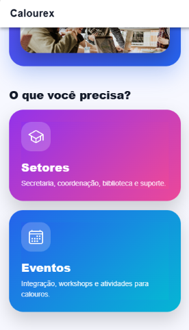

# 🎓 Calourex

Aplicativo mobile desenvolvido com Ionic + Angular para auxiliar estudantes calouros na adaptação ao ambiente universitário.

O projeto foi criado como atividade extensionista da disciplina de Desenvolvimento Mobile da UNISUAM, com foco em acessibilidade, organização profissional, responsividade e compartilhamento de conhecimento técnico.

---

# 📱 Sobre o aplicativo

O Calourex foi desenvolvido para oferecer informações rápidas e acessíveis para novos estudantes da faculdade.

O aplicativo permite:

* Visualizar setores acadêmicos
* Consultar contatos importantes
* Encontrar localizações institucionais
* Conferir eventos universitários
* Facilitar a adaptação dos calouros à vida acadêmica

---

# 🚀 Tecnologias utilizadas

* Ionic
* Angular
* TypeScript
* SCSS
* HTML5
* VSCode
* Git
* GitHub

---

# 🖼️ Funcionalidades

## 🏠 Página Inicial

* Interface moderna e responsiva
* Navegação intuitiva
* Destaque para serviços e eventos

## 🏢 Setores Acadêmicos

* Secretaria acadêmica
* Coordenação
* Biblioteca
* Suporte de TI

## 🎉 Eventos Universitários

* Semana dos calouros
* Workshops acadêmicos
* Integração universitária
* Informações de eventos

---

# 📸 Capturas do Aplicativo

## 🏠 Tela Inicial


---

## 🏢 Setores Acadêmicos


---

## 🎉 Eventos Universitários


---

## 📱 Interface Mobile



---

# ♿ Acessibilidade

O aplicativo possui:

* Interface responsiva
* Ícones intuitivos
* Boa legibilidade
* Estrutura organizada
* Navegação simplificada
* Contraste adequado

---

# 📂 Estrutura do projeto

```bash
src/
 ├── app/
 │    ├── home/
 │    ├── services/
 │    ├── events/
 │    ├── app.routes.ts
 │    └── app.component.ts
```

---

# ⚙️ Como executar o projeto

## Instalar dependências

```bash
npm install
```

## Executar projeto

```bash
ionic serve
```

---

# 🛠️ Como criar o projeto

## Instalar Ionic CLI

```bash
npm install -g @ionic/cli
```

## Criar projeto

```bash
ionic start calourex blank --type=angular
```

---

# 📚 Objetivo extensionista

O projeto possui caráter extensionista por auxiliar estudantes ingressantes na adaptação ao ambiente universitário, fornecendo informações institucionais de maneira prática, acessível e moderna.

Além do desenvolvimento técnico, o projeto também promove compartilhamento de conhecimento sobre Ionic, Angular, Git e GitHub para estudantes iniciantes.

---

# 👨‍💻 Desenvolvimento

Projeto desenvolvido para a disciplina de Desenvolvimento Mobile — UNISUAM.

---

# 📌 Autor

Ana Carolyna Costa Dos Santos

---

# 📄 Licença

Projeto acadêmico para fins educacionais.
